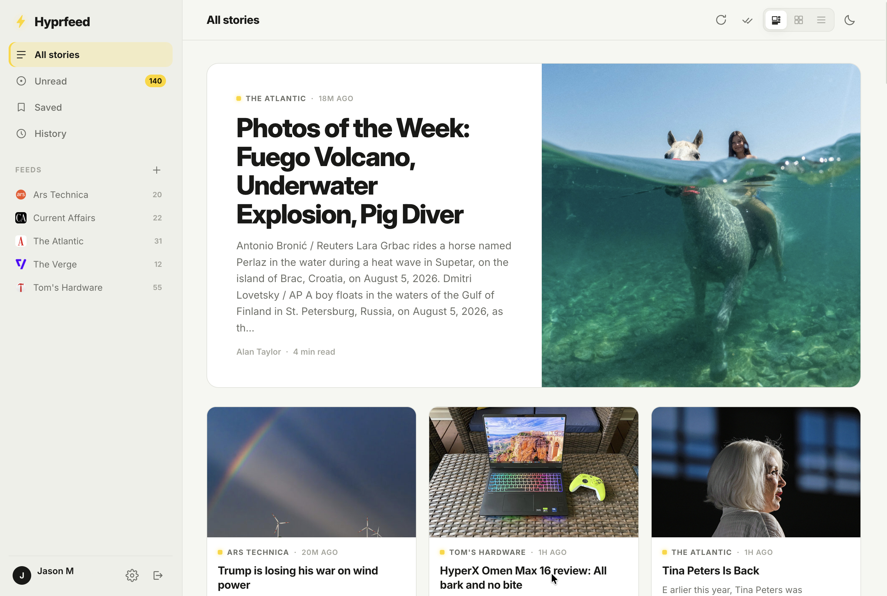

<p align="center">
  
</p>

<h1 align="center">Hyprfeed</h1>

<p align="center"><strong>A self-hosted RSS reader for the open web. Follow any site, even ones without a feed.</strong></p>

<p align="center">
  <a href="https://hub.docker.com/r/hyprlab/hyprfeed"></a>
  <a href="https://github.com/hyprlab/hyprfeed/releases"></a>
  <a href="LICENSE"></a>
</p>

Hyprfeed is a self-hosted, multi-user RSS reader that turns the sites you
follow into a magazine. Paste any website URL and Hyprfeed discovers its
feed. If the site doesn't publish one, it can watch the page itself and
turn new articles into stories.

<p align="center">
  
</p>

## Features

- **Three view modes:** magazine (lead story + mixed grid), cards, and a
  compact list; switch from the topbar, per-user preference remembered
- **Feed auto-discovery:** paste `example.com` and Hyprfeed finds the RSS or
  Atom feed for you
- **Page watcher:** follow sites with *no feed at all*: Hyprfeed detects new
  article links on the page and enriches each story with the article's own
  title, image, description, and publish date
- **Built-in reader:** clean, sanitized article view with reading-time
  estimate and `j` / `k` keyboard navigation
- **Multi-user:** private subscriptions, read state, and saved stories per
  account; email-based sign-in
- **Admin panel:** the first registered account becomes admin and can manage users,
  reset passwords, promote admins, and open/close registration at runtime
- **Cloudflare Turnstile:** optional bot protection on sign-in and sign-up
- **Light & dark themes:** follows your system or your choice, instant toggle
- **Self-contained:** Inter typeface embedded, no CDNs, no external services
  required, SQLite storage in a single Docker volume

## Install with Docker Compose

1. Create a directory with this `docker-compose.yml` (or download it:
   `curl -O https://raw.githubusercontent.com/hyprlab/hyprfeed/main/docker-compose.yml`):

   ```yaml
   services:
     hyprfeed:
       image: hyprlab/hyprfeed:latest
       container_name: hyprfeed
       ports:
         # host:container. Change the left side if 8098 is taken on your host
         - "8098:8000"
       environment:
         # Session signing key. If unset, one is generated and kept in the data volume.
         - SECRET_KEY=${SECRET_KEY:-}
         # Cloudflare Turnstile (optional; leave empty to disable the challenge)
         - TURNSTILE_SITE_KEY=${TURNSTILE_SITE_KEY:-}
         - TURNSTILE_SECRET_KEY=${TURNSTILE_SECRET_KEY:-}
         # Set to 0 to close sign-ups (the admin panel can also toggle this at runtime)
         - ALLOW_REGISTRATION=${ALLOW_REGISTRATION:-1}
         # How often feeds refresh in the background, in minutes
         - REFRESH_MINUTES=${REFRESH_MINUTES:-15}
         # How many stories each feed keeps; older ones are pruned
         - MAX_ENTRIES_PER_FEED=${MAX_ENTRIES_PER_FEED:-300}
       volumes:
         - hyprfeed-data:/data
       restart: unless-stopped

   volumes:
     hyprfeed-data:
   ```

2. (Optional) add a `.env` file next to it to set any of the variables above
   ([`.env.example`](.env.example)). Everything works with the defaults for a
   first run.

3. Start it:

   ```bash
   docker compose up -d
   ```

4. Open **http://localhost:8098** and create your account. **The first
   account registered becomes the admin**, so register yourself before opening
   the instance to others (or set `ALLOW_REGISTRATION=0` after you're in, or
   flip the toggle in Settings → Admin).

> **Note:** the downloaded compose file pulls the published image
> `hyprlab/hyprfeed`. If you `git clone` the repository instead, the included
> `docker-compose.override.yml` makes `docker compose up -d --build` build the
> image from your local source automatically.

### Updating

```bash
docker compose pull && docker compose up -d
```

Schema migrations run automatically on startup. Your data lives in the
`hyprfeed-data` volume and survives updates; backing it up is covered in
[the documentation](docs/DOCUMENTATION.md#backups).

## Documentation

- [Configuration, Turnstile, the page watcher, backups, running from source](docs/DOCUMENTATION.md)
- [Contributing](docs/CONTRIBUTING.md): commits, code conventions, credit
- [Releasing](docs/RELEASING.md): versioning and the release procedure
- [Changelog](CHANGELOG.md), also shown in the app under Settings → About

## Stack

Flask · SQLAlchemy · Flask-Login · feedparser · SQLite · gunicorn. No frontend
framework and no CDN dependencies: the [Inter](https://rsms.me/inter/)
variable font (SIL Open Font License) is bundled in the image.

## AI notice

Hyprfeed is built by a human maintainer working with generative AI as a
development tool:

- **Code:** the large majority of the Python, JavaScript, and CSS in this
  repository was written with Anthropic's Claude (via Claude Code), working
  from the maintainer's direction. The maintainer decides what gets built,
  reviews the results, tests every release, and signs off on everything that
  ships.
- **Text:** documentation, release notes, and in-app copy are largely
  AI-drafted and human-edited.
- **Artwork:** the flat bolt logo and the app's visual design were created
  with the same AI assistance; the dimensional app icon artwork was provided
  by the maintainer.
- **The app itself contains no AI.** Hyprfeed has no AI features, makes no
  requests to AI services, and never sends your reading data anywhere; it
  talks only to the feeds and sites you choose to follow. AI was used to
  *build* the app, not to run it.

Commits are made under the maintainer's name; the tool is declared here once,
for the whole repository, instead of in a trailer on every commit. Bug reports
and pull requests are welcome from humans and their AI tools alike; everything
merged gets the same human review.

## License

Hyprfeed is free software, released under the
[GNU Affero General Public License v3.0](LICENSE) (AGPL-3.0). You may run,
study, share, and modify it. If you run a modified version as a network
service, the AGPL requires you to offer its source code to your users, and the
"Source" link in the app's settings makes that easy to satisfy.

© 2026 Hyprlab
